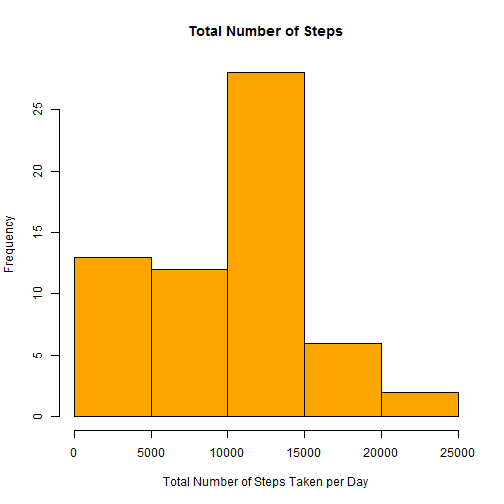
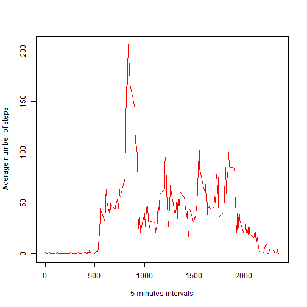
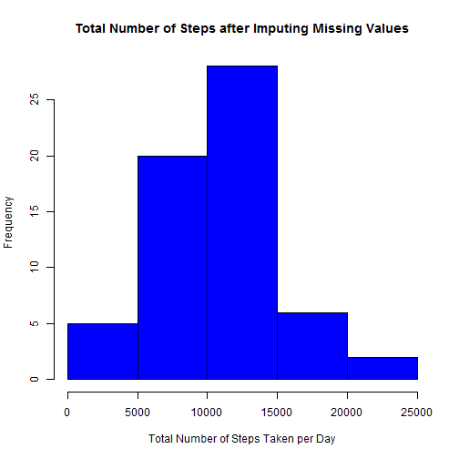
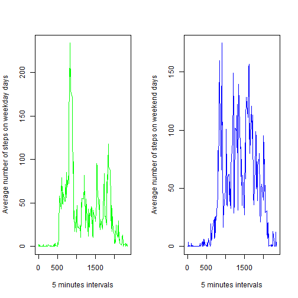

==============================================================================
## Loading and preprocessing the data


```r
a<-read.csv("activity.csv",sep=",",header=TRUE,stringsAsFactors=FALSE)
```

## What is mean total number of steps taken per day?

Histogram of the total number of steps taken each day


```r
b<-with(a,tapply(steps,date,sum, na.rm=TRUE))
hist(b, xlab = "Total Number of Steps Taken per Day", col="orange", main = "Total Number of Steps")
```

 
Mean total number of steps per day:

```r
mean(b)
```

```
## [1] 9354.23
```

Median total number of steps per day:

```r
median(b)
```

```
## [1] 10395
```

## What is the average daily activity pattern?


```r
c<-with(a,tapply(steps,interval,mean, na.rm=TRUE))
plot(unique(a$interval),c,xlab="5 minutes intervals",ylab="Average number of steps", type="l", col="red")
```

 

The 5-minute interval, on average across all the days in the dataset, which contains the maximum number of steps

```r
max(c)
```

```
## [1] 206.1698
```

```r
cf<-c[]>206.1697
c[cf]
```

```
##      835 
## 206.1698
```
## Imputing missing values

Total number of missing values in the dataset

```r
sum(is.na(a))
```

```
## [1] 2304
```
Imputing missing values as mean of the given day

```r
am<-read.csv("activity.csv",sep=",",header=TRUE,stringsAsFactors=FALSE)
d<-with(am,tapply(steps,date,mean, na.rm=TRUE))
impcol<-d
z<-0
repeat {
    z<-z+1 
    impcol<-c(impcol,d) 
    if (z>286) break()
}
am<-cbind(am,impcol)

for (i in seq_along(am[,1])){
    if (is.na(am[i,1])) {
        am[i,1]<-am[i,4]
    }
    else {
        next
       }
}
bm<-with(am,tapply(steps,date,sum, na.rm=TRUE))
hist(bm, xlab = "Total Number of Steps Taken per Day", col="blue", main = "Total Number of Steps after Imputing Missing Values")
```

 

Mean total number of steps per day:

```r
mean(bm)
```

```
## [1] 10579.21
```

Median total number of steps per day:

```r
median(bm)
```

```
## [1] 10395
```
Imputing missing values changed the mean total number of steps per day. Mean total number of days were increased.

Imputing missing values did not change the median total number of steps per day.


## Are there differences in activity patterns between weekdays and weekends?


```r
a$dated<-as.Date(a$date)
Sys.setlocale("LC_TIME", "C")
```

```
## [1] "C"
```

```r
a$wd<-weekdays(a$dated)

for (i in seq_along(a[,5])){
    if (a[i,5] %in% c("Saturday","Sunday"))
        {a[i,6]<-"weekend"
    }
    else {
        a[i,6]<-"weekday"
    }
}
a[,6]<-as.factor(a[,6])
colnames(a)[6]<-"fact"

a1<-subset(a,fact=="weekday")
a2<-subset(a,fact=="weekend")

par(mfrow=c(1,2))

c1<-with(a1,tapply(steps,interval,mean, na.rm=TRUE))
plot(unique(a$interval),c1,xlab="5 minutes intervals",ylab="Average number of steps on weekday days", type="l", col="green")
c1<-with(a2,tapply(steps,interval,mean, na.rm=TRUE))
plot(unique(a$interval),c1,xlab="5 minutes intervals",ylab="Average number of steps on weekend days", type="l", col="blue")
```

 
